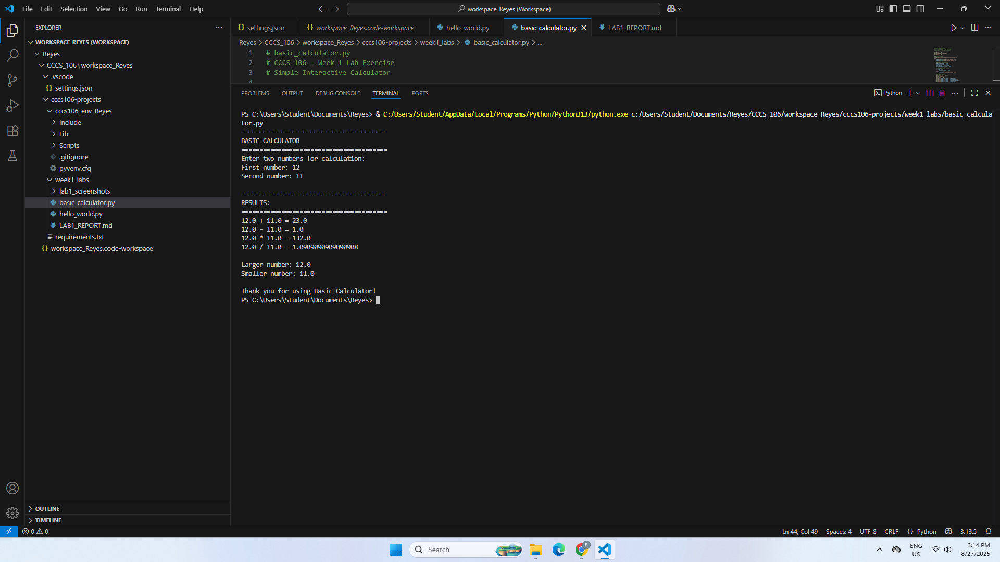
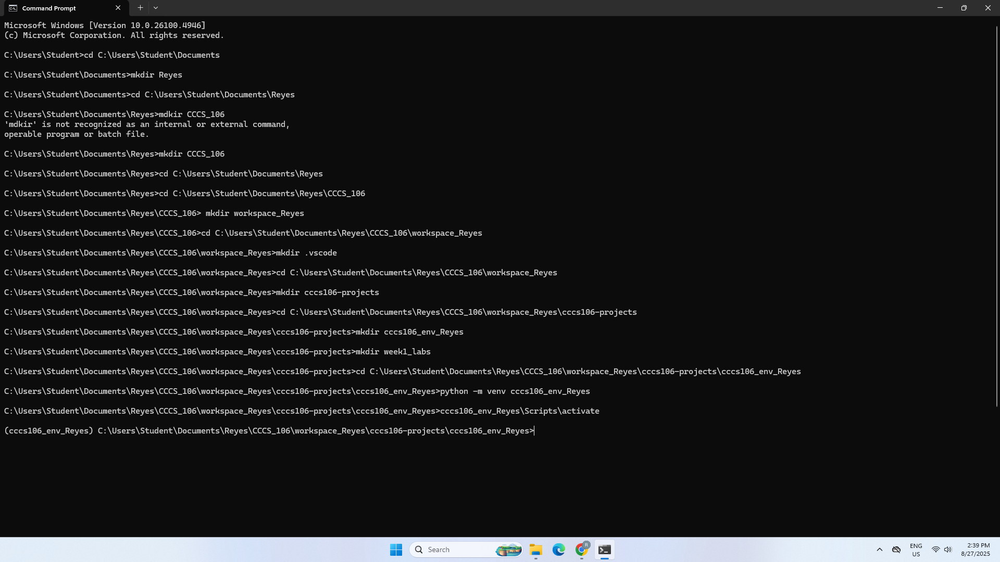
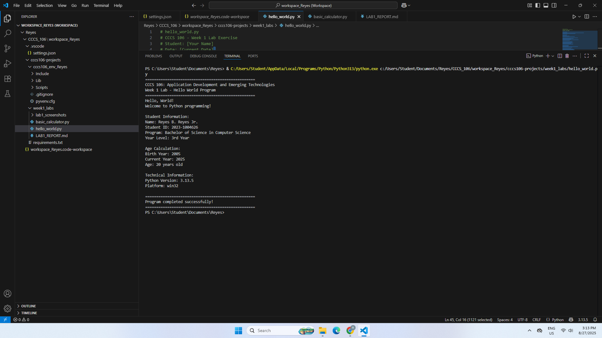
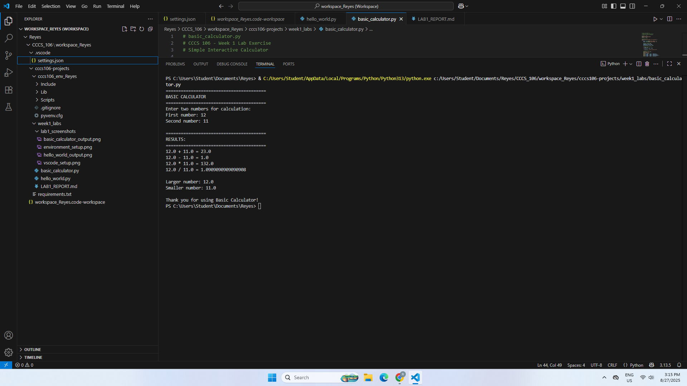

**Student Name:** Reynaldo B. Reyes Jr. \
**Student ID:** 231004626 \
**Section:** BSCS - 3B \
**Date:** August, 27 2025

## Environment Setup

### Python Installation
- **Python Version:** [e.g., 3.11.5]
- **Installation Issues:** [Describe any problems and solutions]
- **Virtual Environment Created:** ✅ cccs106_env_Reyes

### VS Code Configuration
- **VS Code Version:** [e.g., 1.82.0]
- **Python Extension:** ✅ Installed and configured
- **Interpreter:** ✅ Set to cccs106_env_Reyes/Scripts/python.exe

### Package Installation
- **Flet Version:** 0.28.3
- **Other Packages:** []

## Programs Created

### 1. hello_world.py
- **Status:** ✅ Completed
- **Features:** Student info display, age calculation, system info
- **Notes:** [During the development of the Hello World program, it became apparent that the simplicity of Python enables easy formatting of the output with print statements. The f-strings were much simpler to use than concatenation because of the ease with which they could be used to show variables such as student information and age. The only minor problem was that I couldn't recall the correct syntax to import sys to show Python version and platform information, which was straightened out and the program executed flawlessly afterwards.]

### 2. basic_calculator.py
- **Status:** ✅ Completed
- **Features:** Basic arithmetic, error handling, min/max calculation
- **Notes:** [There was also the difficulty of handling invalid inputs (letters, rather than numbers) and division by zero. Enclosing the input and operations in a try-except block made the program more friendly to the user and avoided crashes. I also noticed that Python functions max() and min() provided me an opportunity to compare numbers without the need to create additional logic.]

## Challenges and Solutions

[Challenge 1: Virtual Environment Setup Since Python was not initially identified in the terminal. This problem was resolved by making sure that the Add Python to PATH option was selected during installation and restarting of the terminal.

Challenge 2: Division by Zero - When num2 = 0 was entered, the calculator ran an error. Solution: attempted to use an if statement to catch a zero and display a custom message (Cannot divide by zero).

Challenge 3: Bad User Input- Entering the calculator using text, rather than numbers, resulted in a crash. Solution: added a try-except ValueError block to show an error message, rather than terminate the program.]

## Learning Outcomes

[I also got practical knowledge of Python fundamentals including print statements, variables, arithmetic, and exception management. I also learned about the value of the virtual environment in maintaining order in the project, and preventing package conflicts. All in all, this lab helped me feel more at ease with not only the tools (Python, VS Code, virtual environments) but also the underlying concepts of programming I will work with during the course.]

## Screenshots

