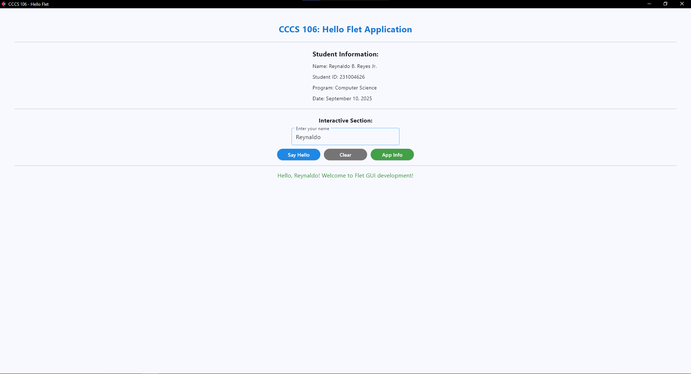
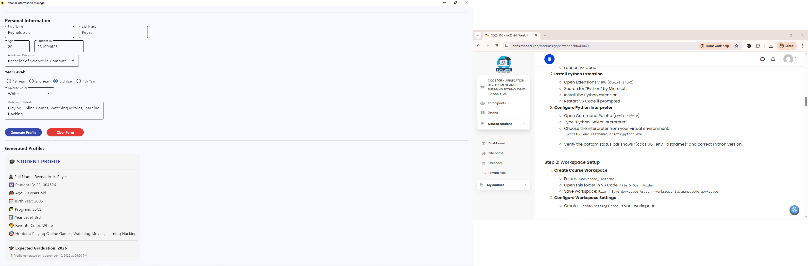

**Student Name:** Reynaldo B. Reyes Jr.
**Student ID:** 231004626
**Section:** B
**Date:** September 4, 2025

## Git Configuration

### Repository Setup
- **GitHub Repository:** [[Your repository URL](https://github.com/Reylan25/cccs106-projects)]
- **Local Repository:** ✅ Initialized and connected
- **Commit History:** [Number] commits with descriptive messages

### Git Skills Demonstrated
- ✅ Repository initialization and configuration
- ✅ Adding, committing, and pushing changes
- ✅ Branch creation and merging
- ✅ Remote repository management

## Flet GUI Applications

### 1. hello_flet.py
- **Status:** ✅ Completed
- **Features:** Interactive greeting, student info display, dialog boxes
- **UI Components:** Text, TextField, Buttons, Dialog, Containers
- **Notes:** [As I was developing this application, I realized that when designing the layout, I would have to be keen in how I set it up to ensure that the interface was well balanced and easy to use. It was intriguing to witness how Flet components functioned in the same way as web development components, yet again all in Python. Initially, it was difficult to grasp what page.update() did to update the UI, but later on I understood the significance of this in making the UI highly interactive.]

### 2. personal_info_gui.py
- **Status:** ✅ Completed
- **Features:** Form inputs, dropdowns, radio buttons, profile generation
- **UI Components:** TextField, Dropdown, RadioGroup, Containers, Scrolling
- **Error Handling:** Input validation and user feedback
- **Notes:** [It was a more complicated application since it had several input fields, dropdowns, and validation. I noticed that the form fields were not fully loaded, this could result in errors and thus input validation and error management was required. The experience has helped me understand more about the way GUIs process user data, and the value of feedback to a positive user experience.]

## Technical Skills Developed

### Git Version Control
- Understanding of repository concepts
- Basic Git workflow (add, commit, push)
- Branch management and merging
- Remote repository collaboration

### Flet GUI Development
- Flet 0.28.3 syntax and components
- Page configuration and layout management
- Event handling and user interaction
- Modern UI design principles

## Challenges and Solutions

[Initially, there were a number of technical problems. The most difficult task proved to be learning how to correctly apply Git commands such as commit, pull, and push, as initially, I lacked an overall understanding of how everything works. Having checked the discussions in the class and recalling the advice given to me by Sir Ibo during lab time, I was able to use the correct order of commands and managed to pair the local and the remote version of the repository.

The other problem I faced was associated with the setting of the Python environment and pip. First, pip did not exist in my system, so I could not install Flet. The answer was to enter the Environment Variables and paste the Python installation folder path and add it to the system PATH. Then pip began to work again.

Finally, I also had a problem with the installation of Flet when when I entered the wrong command. Having reviewed the documentation and made the right corrections, I ran pip install flet==0.28.3 and it corrected the error. I could successfully run both applications through trial, error, and research.]

## Learning Outcomes

[First, there were several technical issues. Learning to use the Git commands correctly, commit, pull, and push, was the hardest part as at the beginning, I did not have the general idea of how everything functions. After reviewing the conversation on the class and remembering the recommendations Sir Ibo had made to me on the lab period, I could use the right sequence of instructions and was able to match the local and the remote copy of the repository.

The other issue that I encountered was related to the configuration of the Python environment and pip. Firstly, pip was not available in my system, and thus I was not able to install Flet. The solution could be to go to the Environment variables and enter the Python installation path and append it to the system PATH. Then pip began to work again.

Lastly, another issue that I experienced was installing Flet when I typed in the incorrect command. After perusing the documentation and correcting the mistakes accordingly, I pip installed flet 0.28.3 and it fixed the error. I would be able to test both applications by trial, error, and study.]

## Screenshots

### Git Repository
- [ ] GitHub repository with commit history

- [ ] Local git log showing commits

### GUI Applications
- [ ] hello_flet.py running with all features

- [ ] personal_info_gui.py with filled form and generated profile

## Future Enhancements

[Ideas for improving the applications or additional features to implement]